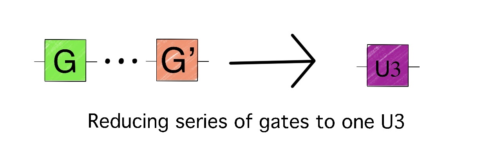
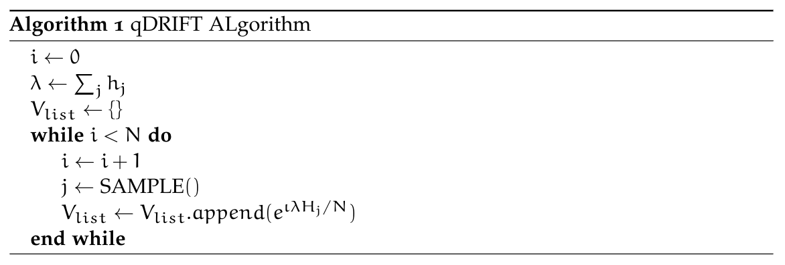
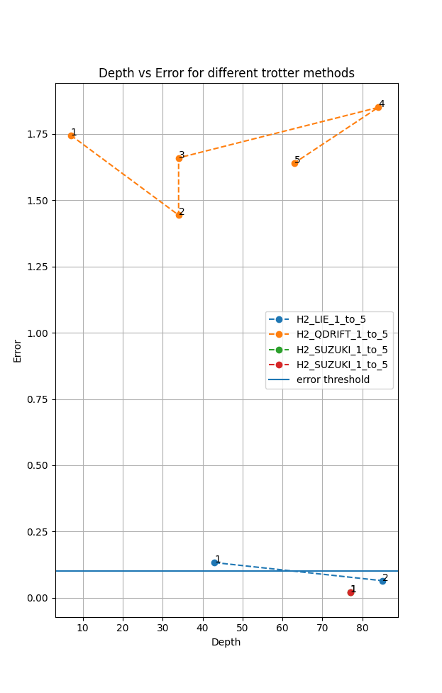
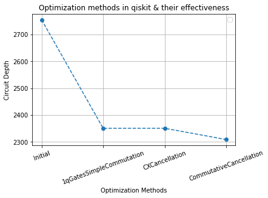

# Classiq Hamiltonian Simulation

# Problem Statement

Generate a circuit, using no more than 10 qubits, that approximates the unitary $e^{-iH}$ where $H$ is the qubit hamiltonian of the LiH molecule composed of 276 Pauli strings. The target is to simulate it with an error less than 0.1 using the circuit of minimum depth composed only of CX and single-qubit gates.

### Error Calculation

The “distance” between the approximated circuit and the real unitary operator is defined by the operator norm of the difference between the two operators

$$
error = || U_{circuit} - e^{-iH}||
$$

where operator norm is defined as the maximal eigenvalue of the operator $||A|| = \max|\lambda_i|$ where $\lambda_i$ are the eigenvalues of $A$. Note that we must eliminate the global phase from both the matrices before we can subtract and calculate the largest eigenvalue. 

This is done by setting the phase of the first non-zero element to 0.

## Circuit constraints

> The circuit should be composed of the CX and single-qubit gates only.
> 

Since there was a restriction on using only two-qubit CX gates along with *any* single-qubit gates, we decided to pick our universal gate set to be `['u3', 'cx']`. `u3` gates are standard three-parameter single-qubit gates that are available in qasm.

### `u3` Gate

A `u3` gate takes in three parameters and applies the following operation [source: qiskit [documentation](https://qiskit.org/documentation/stubs/qiskit.circuit.library.U3Gate.html)]

$$
U3(\theta,\phi, \lambda) = RZ(\phi)RX(-\pi/2)RZ(\theta)RX(\pi/2)RZ(\lambda)
$$

This gate is a universal single-qubit gate that can represent *any* other single-qubit unitary transformation. This allows us to compress down a stream of single-qubit gates into a single gate.



An example slice of a circuit will look like the following:

```bash
circuit:
	 ┌──────────────────┐                                  
q_0: ┤ U3(0,0,-0.44686) ├──■──────────────────────────
     ├──────────────────┤  │
q_1: ┤ U3(0,0,-0.44686) ├──┼────■─────────────────────
     ├─────────────────┬┘┌─┴─┐  │  ┌─────────────────┐
q_2: ┤ U3(0,0,0.34283) ├─┤ X ├──┼──┤ U3(0,0,0.24125) ├
     ├─────────────────┤ └───┘┌─┴─┐├─────────────────┤
q_3: ┤ U3(0,0,0.34283) ├──────┤ X ├┤ U3(0,0,0.24125) ├
     └─────────────────┘      └───┘└─────────────────┘
```

# Trotterization

Our goal is to implement $U = e^{iHt} = e^{i\Sigma_j H_j t}$. In general,  matrix  $e^{A+B}$ need not equal $e^Ae^B$ if $A$ and $B$ do not commute. The Lie Suzuki-Trotter decomposition gives us a way to handle this. It uses the fact that if $A$ and $B$ have a small operator norm, then $e^{A+B}$ and $e^Ae^B$ are approximately equal: $e^{A+B} = e^Ae^B+E$, where $E$ is the error term.

Using the Lie-Trotter formula we can approximate our target unitary $U$ as the following.

$$
\tilde{U} = (e^{iH_1t/r}\dots e^{iH_mt/r})^r
$$

which is equivalent to applying the trotter approximation for small time-steps of $t/r$, here $r$ is the repetition count. The Trotter methods that we have adapted through the library of qiskit are:

- Suzuki Trotter
- Lie Trotter
- Randomized Trotter

Both Suzuki Trotter and Lie Trotter are well known. Since the required error rate was 0.1, there was no necessity of increasing the repetitions, the required error rate was achieved in one repetition. It is also well known that Suzuki Trotter performs well only for even orders, it is often the case that there is a trade-off between order and repetition required for a low error rate but as the required error rate was achieved in single repetition there was no necessity to go beyond Suzuki order 2.

## Randomized Trotter

A different approach was taken through the QDRIFT algorithm that is given below. Note that this algorithm did not perform well compared to standard Trotterization.  



# Experimentation with $H_2$ molecule

A good approach is an approach that also comes with an explanation of the failed methods, in this section we will be presenting the methods we experimented with that did not work out. Since $LiH$ has a large hamiltonian that will require a lot of computational power to experiment with, we first tested our methods on $H_2$ for faster computation. The hamiltonian for the Hydrogen molecule was generated through Pennylane’s chemistry module `qchem` on the `H2.xyz` file present [here](https://github.com/susilehtola/erkale/blob/master/tests/xyz/H2.xyz).

Apart from the standard three Trotter methods mentioned above, we also tried using circuit approximation of a target unitary.

## Trotterization

Comparing Trotter against each other, we obtained the following plot:



It is clear that Randomized Trotter performance is much worse compared to the other methods. This is due to a lack of terms, ideally, we require the number of terms to be $O(n^4)$ where $n$ is the number of qubits. Since $H_2$ is sparse, QDRIFT suffers from a high error value.

Note that we terminate the number of repetitions the moment the error rate goes below 0.1, this is because more repetitions will only increase the circuit depth and provide us with lesser error.

There was a hard limit of 5 for the number of repetitions which is why QDRIFT stopped without trying with more repetitions.

## Circuit Approximation

Using the approximate quantum compiler present in qiskit, we tried generating a circuit for the target unitary, i.e. $U = e^{\iota tH}$, after a little hyperparameter tuning for the depth, we obtained a circuit with a depth of 114 and error 0.09. Clearly, a more structured approach rather than relying on optimization methods was more fruitful in terms of circuit depth. 

The above result leads us to the conclusion that circuit approximation is not worth attempting for the larger target molecule as it is quite resource-demanding and performs sub-optimal when compared to standard Trotter methods.

## Circuit Optimization

Using the vast library of qiskit, we made a class for circuit optimization that will run multiple passes over the decomposed circuit and tries to further reduce the circuit depth. We used the following in-built passes [refer qiskit documentation for all passes [here](https://qiskit.org/documentation/stable/0.26/search.html?q=passes&check_keywords=yes&area=default)] which are under circuit optimization only.

- `simple_commutation_pass`
- `cancel_cx_pass`
- `commutative_analysis_pass`
- `commutative_cancellation_pass`

Any other passes did not seem useful apart from this, the following plot will show how effective these circuit optimizations were:



Note that the effectiveness is limited since the circuit is unrolled on a constrained basis. There is very little scope for circuit optimization.

# LiH molecule simulation

We started with the first-order trotter simulation with a single repetition. Using this we got an error $<0.1$ . So higher-order trotter and other optimization techniques for trotter simulation like the grouping of commuting Pauli operator were not helpful.

Using the LiH strings (in the exact order that they were provided), without performing any form or lexical analysis or changes in the ordering of terms, we obtained a circuit depth of $2309$ with an error of $0.0839846$.

### Changing the order of the terms

We then optimized the circuit by changing the order of the terms to maximize gate cancellation. Here, by terms, we mean the $276$ Pauli strings that make up the LiH hamiltonian.

Our main motto at this phase of circuit optimization was to come up with the best possible ordering of the Pauli strings.

Several ordering techniques we used are:

- Lexicographic Term Ordering
- Interleave Term Ordering
- Magnitude Term Ordering

The best result we obtained at this stage was: $2056$ (depth) and $0.0834046$ (error).

### Grouping of term

We also grouped the terms based on their coefficients and tried ordering amongst groups (inter-group order) as well as the ordering terms within a given group (intra-group order).

After grouping the best result we obtained was a depth of $1999$ at an error of $0.083285206693$.

### Removing terms from the Hamiltonian

We simplified the Hamiltonian heuristically to search for the group of terms removing which change the Hamiltonian only slightly. This reduced the depth to $1425$ with an error of $0.0985824270758$.

### Re-calibrating coefficients

Upon deleting some group of terms, we observed an increase in error which could be mitigated by increasing or decreasing the coefficients of certain terms which have common substrings with the deleted ones. We used binary search to obtain the amount by which the coefficient had to be increased or decreased.

Using re-calibration, we arrived at a depth of $1311$ with an error of $0.0989012190291026$.

## Best Result

After all the optimizations (described above) we got the following result:

> **Circuit Depth: $1311$**
**Error: $0.0989012190291026$**
> 


